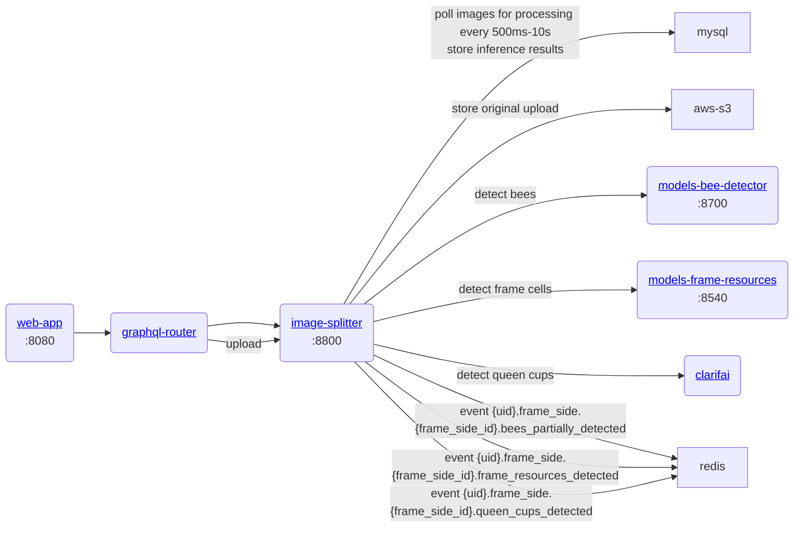

# gratheon / image-splitter
Main image processng microservice.
Uses custom yoloV5 model for inference

### URLs
localhost:8800

## Architecture


```mermaid
flowchart LR
    web-app("<a href='https://github.com/Gratheon/web-app'>web-app</a>\n:8080") --> graphql-router("<a href='https://github.com/Gratheon/graphql-router'>graphql-router</a>") --> image-splitter("<a href='https://github.com/Gratheon/image-splitter'>image-splitter</a>\n:8800") --"poll images for processing every 500ms-10s\nstore inference results"--> mysql
    graphql-router --upload--> image-splitter --"store original upload"--> aws-s3
	image-splitter --"detect bees"--> models-bee-detector("<a href='https://github.com/Gratheon/models-bee-detector'>models-bee-detector</a>\n:8700")
	image-splitter --"detect frame cells"--> models-frame-resources("<a href='https://github.com/Gratheon/models-frame-resources'>models-frame-resources</a>\n:8540")
	image-splitter --"detect queen cups"--> clarifai("<a href='https://clarifai.com'>clarifai</a>")

	image-splitter --"event {uid}.frame_side.{frame_side_id}.bees_partially_detected"--> redis
    image-splitter --"event {uid}.frame_side.{frame_side_id}.frame_resources_detected"--> redis
    image-splitter --"event {uid}.frame_side.{frame_side_id}.queen_cups_detected"--> redis
```

### Development
```
make start
```
