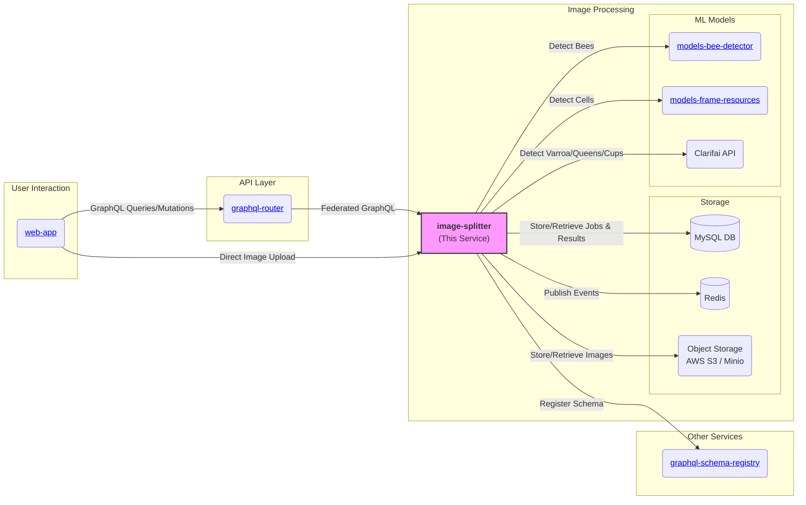
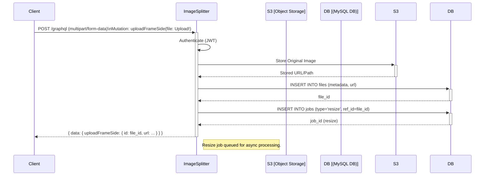
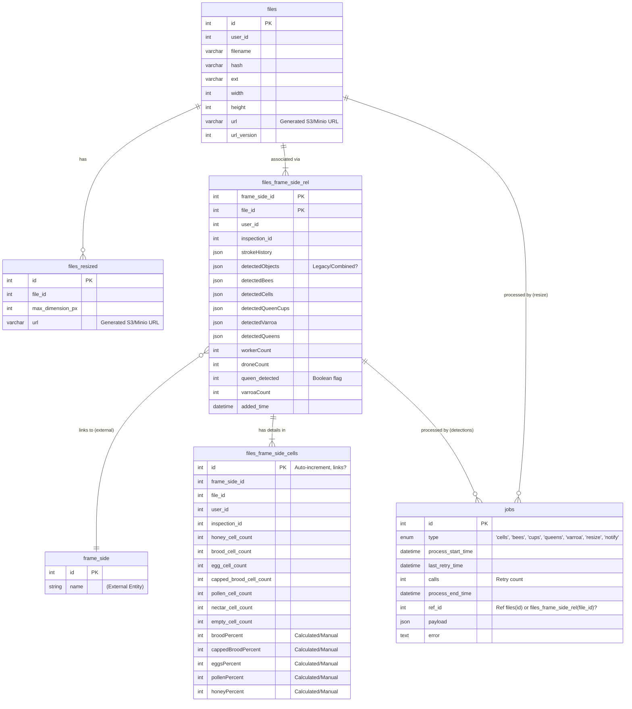
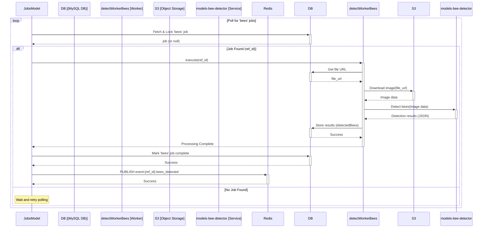
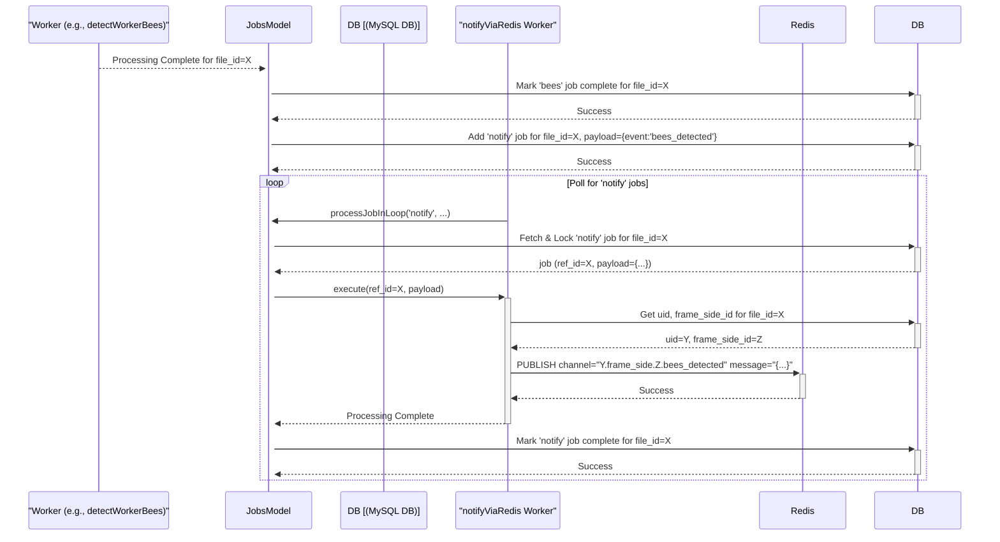

# Gratheon / image-splitter

[](https://snyk.io/test/github/Gratheon/image-splitter)


## Overview

The `image-splitter` microservice is a core component of the Gratheon platform responsible for processing images of beehive frames uploaded by users. Its primary function is to orchestrate the analysis of these images by invoking various internal and external machine learning models to detect key elements like bees (workers, drones, queens), brood cells, pollen, honey, queen cups, and varroa mites.

It receives uploaded images, stores them, manages a queue of analysis jobs, calls detection models, aggregates the results, and makes them available via the platform's federated GraphQL API. It also generates resized versions (thumbnails) of the original images.

**Key Responsibilities:**

*   Accepting direct image uploads (frame sides).
*   Storing original images and generated thumbnails in object storage (AWS S3/Minio).
*   Managing an asynchronous job queue (using MySQL) for various detection tasks (resizing, bees, cells, queen cups, varroa, queens).
*   Orchestrating calls to internal ML models (`models-bee-detector`, `models-frame-resources`) and external services (Clarifai) for specific detections.
*   Storing detection results (bounding boxes, counts, percentages) in the database.
*   Publishing processing status updates via Redis Pub/Sub.
*   Exposing processed data and initiating actions (like AI advice generation) through a federated GraphQL API.

## Key Features

*   Direct, authenticated image upload handling.
*   Asynchronous, persistent, and retry-capable job processing for image analysis tasks.
*   Integration with multiple ML models for comprehensive frame analysis.
*   Generation of image thumbnails.
*   Storage of raw detection data (e.g., bounding boxes) and summary statistics.
*   Federated GraphQL endpoint for querying results and managing frame data.
*   Integration with Sentry for error monitoring.
*   Configurable storage backend (AWS S3 for production, Minio for development/testing).

## Architecture

### High-Level Service Diagram



### Technology Stack

*   **Language:** TypeScript
*   **Framework:** Fastify
*   **API:** GraphQL (Apollo Server v3, Apollo Federation v1)
*   **Database:** MySQL (`@databases/mysql`)
*   **Job Queue:** Custom implementation using MySQL table (`jobs`)
*   **Cache/PubSub:** Redis (`ioredis`)
*   **Object Storage:** AWS S3 / Minio (`@aws-sdk/client-s3`)
*   **Image Processing:** Jimp, webp-converter
*   **ML Integrations:** Clarifai gRPC (`clarifai-nodejs-grpc`), Internal REST APIs
*   **Containerization:** Docker, Docker Compose
*   **Monitoring:** Sentry (`@sentry/node`)
*   **Testing:** Jest

## API Documentation

The service exposes a GraphQL endpoint, typically accessed via the federated `graphql-router`. However, for file uploads, clients interact directly with this service due to limitations in GraphQL federation handling `multipart/form-data`.

## URLs

*   Development: `http://localhost:8800/graphql`
*   Production: `https://image.gratheon.com/graphql` (Note: Uploads go directly here, not via the main router)

**Authentication:**

*   Requests via the router are authenticated using an internal signature (`internal-router-signature` header).
*   Direct requests (like uploads) must include a JWT in the `token` header.

### Key Mutations

*   `uploadFrameSide(file: Upload!): File`: Uploads a frame side image. Initiates the processing pipeline by creating relevant jobs (resize, detections).
*   `addFileToFrameSide(frameSideId: ID!, fileId: ID!, hiveId: ID!): Boolean`: Associates an uploaded file with a specific frame side and hive.
*   `filesStrokeEditMutation(files: [FilesUpdateInput]): Boolean`: Saves user-drawn annotations on an image.
*   `updateFrameSideCells(cells: FrameSideCellsInput!): Boolean!`: Allows manual correction of detected cell percentages.
*   `confirmFrameSideQueen(frameSideId: ID!, isConfirmed: Boolean!): Boolean!`: Manually confirms or denies the presence of a queen on a frame side.
*   `generateHiveAdvice(hiveID: ID, adviceContext: JSON, langCode: String): String`: Triggers a call to an external AI (e.g., GPT-4 via Clarifai) to generate advice based on hive data.
*   `cloneFramesForInspection(frameSideIDs: [ID], inspectionId: ID!): Boolean!`: Creates copies of frame side data associated with a new inspection record.

### Key Queries

*   `file(id:ID!): File`: Retrieves details about a specific file, including its resizes.
*   `hiveFiles(hiveId:ID!): [FrameSideFile]`: Gets all frame side files associated with a hive.
*   `hiveFrameSideFile(frameSideId:ID!): FrameSideFile`: Gets detailed information for a specific frame side file, including detection results.
*   `hiveFrameSideCells(frameSideId:ID!): FrameSideCells`: Gets the cell composition statistics for a frame side.
*   `frameSidesInspections(frameSideIds: [ID], inspectionId:ID!): [FrameSideInspection]`: Retrieves data for specific frame sides within the context of an inspection.

### Upload Sequence Diagram


*(Note: Subsequent detection jobs are typically added after `addFileToFrameSide` associates the file with a frame side)*

## Database Schema

The service uses a MySQL database to store file metadata, job queue information, and detection results.

**Key Tables:**

*   `files`: Stores metadata about uploaded original images (filename, dimensions, user_id, S3 URL).
*   `files_resized`: Stores information about generated thumbnails/resizes for each file.
*   `files_frame_side_rel`: Join table linking `files` to frame sides. Stores detection results (JSON blobs for bees, cells, cups, varroa, queens), counts, and user annotations (`strokeHistory`). Also includes `inspection_id`.
*   `files_frame_side_cells`: Stores detailed cell counts and calculated percentages (brood, honey, pollen, etc.) for a frame side. Includes `inspection_id`.
*   `files_frame_side_queen_cups`: (Potentially deprecated/merged into `files_frame_side_rel` based on migrations) Previously stored queen cup detection status. Includes `inspection_id`.
*   `jobs`: Manages the asynchronous processing queue. Tracks job type, status (start/end times), retries (`calls`), errors, payload, and the reference ID (`ref_id`) linking to the relevant entity (e.g., `file_id`).

### Entity-Relationship Diagram (ERD)



## Asynchronous Processing

The service utilizes a database-backed job queue (`jobs` table) for handling time-consuming image analysis tasks asynchronously.

**Workflow:**

1.  **Job Creation:** When an image is uploaded (`uploadFrameSide`) or associated with a frame (`addFileToFrameSide`), relevant jobs (`resize`, `bees`, `cells`, etc.) are inserted into the `jobs` table with a reference ID (`ref_id`) pointing to the `files.id`.
2.  **Polling:** Background workers (initiated by `orchestrator.ts`) continuously poll the `jobs` table for specific job types (`processJobInLoop` in `jobs.ts`).
3.  **Job Locking:** To prevent concurrent processing, a worker attempts to lock an available job by setting its `process_start_time`. A job is considered available if `process_start_time` is NULL or older than 1 minute (timeout).
4.  **Execution:** If a job is successfully locked, the corresponding handler function (e.g., `detectWorkerBees`, `resizeOriginalToThumbnails`) is executed with the `ref_id` and `payload`.
5.  **External Calls:** Handlers may call internal ML services or external APIs (like Clarifai). They typically involve downloading the image from S3/Minio first.
6.  **Result Storage:** Upon successful completion, results are stored in the relevant database tables (e.g., `files_frame_side_rel`, `files_frame_side_cells`).
7.  **Job Completion/Failure:** The job is marked as complete by setting `process_end_time`. If an error occurs, the error details are logged in the `error` column, the `calls` counter is incremented, and `process_end_time` is set.
8.  **Retries:** Failed jobs are automatically retried up to 2 times (total 3 `calls`).
9.  **Notification:** A special `notify` job type exists, handled by `notifyViaRedis`, which publishes events to Redis upon completion of certain detection steps. This likely signals downstream services or the frontend about processing updates.

### Worker Sequence Diagram (Simplified Example: Bee Detection)



## Redis Events / Notifications

Upon successful completion of certain asynchronous detection jobs, the service publishes events to a Redis Pub/Sub channel. This allows downstream services (e.g., `event-stream-filter`, `web-app`) to react to processing updates in real-time.

**Mechanism:**

1.  A detection worker (e.g., `detectWorkerBees`) finishes processing for a `file_id`.
2.  It marks its specific job as complete in the `jobs` table.
3.  Crucially, it enqueues a new job of type `notify` into the `jobs` table, often including the original `file_id` (as `ref_id`) and potentially context about the completed step in the payload.
4.  The `notifyViaRedis` worker picks up this `notify` job.
5.  This worker likely queries the database using the `ref_id` (file\_id) to retrieve associated identifiers like `user_id` (`uid`) and `frame_side_id`.
6.  It constructs an event topic string using these identifiers.
7.  It publishes a message (often just a simple notification, the details are usually fetched via GraphQL later) to the specific Redis channel.

**Event Pattern:**

The general pattern for the Redis channel is: `{uid}.frame_side.{frame_side_id}.<detection_type>_detected`

**Key Events Published:**

*   `{uid}.frame_side.{frame_side_id}.bees_detected`
*   `{uid}.frame_side.{frame_side_id}.cells_detected` (or `frame_resources_detected`)
*   `{uid}.frame_side.{frame_side_id}.queen_cups_detected`
*   `{uid}.frame_side.{frame_side_id}.queens_detected`
*   `{uid}.frame_side.{frame_side_id}.varroa_detected`

*(Note: The exact event names might vary slightly based on implementation details in `notifyViaRedis.ts`)*

### Notification Sequence Diagram



## Configuration

Configuration is managed via files in `src/config/` (`config.default.ts`, `config.dev.ts`, `config.testing.ts`) and environment variables. Key configuration options (refer to `config.default.ts` for defaults):

*   `routerSignature`: Secret shared with `graphql-router`.
*   `sentryDsn`: DSN for Sentry error reporting.
*   `schema_registry_url`: URL for the GraphQL Schema Registry.
*   `selfUrl`: Publicly accessible URL of this service for the registry.
*   `yolo_v5_url`: Endpoint for the internal bee detection model.
*   `models_frame_resources_url`: Endpoint for the internal cell detection model.
*   `mysql`: Database connection details (host, port, user, password, database).
*   `aws`: S3/Minio configuration (bucket, key, secret, endpoint, public URL).
*   `jwt.privateKey`: Secret key for JWT verification (must match `user-cycle` service).
*   `clarifai`: API Keys (PATs) for different Clarifai applications (varroa, queen, cups, beekeeper AI).

Environment variables like `NATIVE` (for local vs. Docker) and `ENV_ID` (dev, testing, prod) influence which configuration values are used.

## Development

1.  **Prerequisites:** Node.js, Docker, Docker Compose, Just (`just --list` for commands).
2.  **Configuration:** Copy `src/config/config.default.ts` to `src/config/config.dev.ts`. Update necessary values (e.g., AWS/Minio credentials, Clarifai PATs).
3.  **Start Services:** Run `just start` to build and start the service and its dependencies (MySQL, Minio, Redis, etc.) using Docker Compose (`docker-compose.dev.yml`).
4.  **Access:**
    *   Service: `http://localhost:8800/graphql`
    *   Minio Console: `http://localhost:19001` (Credentials: `minio-admin` / `minio-admin`)

### Database Migrations

Migrations are plain SQL files located in the `migrations/` directory. They are applied automatically on service startup using `@databases/mysql`.

*   **Adding Migrations:** Create a new SQL file in `migrations/` following the naming convention (e.g., `020-new-feature.sql`). The service will apply it on the next restart.
*   **Schema Generation:** You can generate TypeScript types from the DB schema using `npm run generate-db-schema` (ensure DB is running).

## Testing

*   **Unit Tests:** Uses Jest. Run with: 
```bash
npm run test:unit
```

*   **Integration Tests:** Spins up a dedicated test environment using `docker-compose.test.yml` (including Minio, MySQL) and runs Jest tests against the running service.
```bash
just test-integration
```

## Deployment

*   The service is designed to run in Docker containers.
*   `Dockerfile.prod` defines the production image build process.
*   `docker-compose.yml` provides an example of production deployment configuration (though actual deployment might use Kubernetes or other orchestrators).
*   **Key Production Differences:**
    *   Uses AWS S3 instead of Minio (configure `aws` settings appropriately).
    *   Connects to production database and Redis instances.
    *   Requires valid Sentry DSN and Clarifai PATs.
    *   Listens on port 8800 internally. An ingress/load balancer typically handles external access and SSL termination.
*   A health check endpoint is available at `/healthz`.

## Monitoring & Logging

*   **Error Reporting:** Integrated with Sentry (`sentryDsn` must be configured).
*   **Logging:** Uses Fastify's standard logger (`pino`) configured in `src/logger/`. Logs are output to stdout/stderr within the container.

## License

This project is **dual-licensed**:

- **[AGPL v3](LICENSE-AGPL.md)** - For open source use:
    - ✅ You can use, modify, and distribute the software
    - ✅ Source code is freely available
    - ⚠️ If you modify and host a public instance, you must share your modifications
    - ⚠️ Any derivative work must also be licensed under AGPL v3

- **[Commercial License](LICENSE-COMMERCIAL.md)** - For enterprise customers who need:
    - 🏢 On-premise deployment without source disclosure
    - 🔧 Custom modifications without copyleft obligations
    - 📞 Priority support and SLA guarantees


### Contributing

If you'd like to contribute, please see our [Contributing Guide](CONTRIBUTING.md) and sign our Contributor License Agreement (CLA).

*   Please refer to the `CODEOWNERS` file for ownership details.
*   Follow standard GitHub flow: Fork the repository, create a feature branch, make changes, and submit a Pull Request.