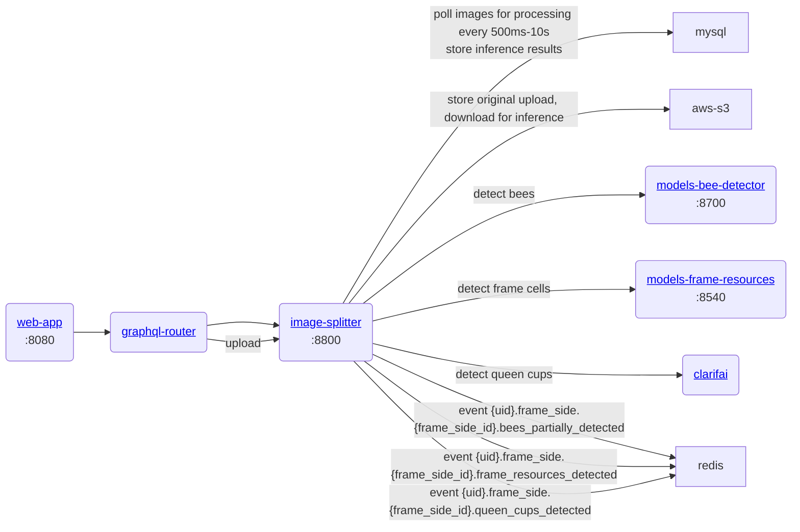

# gratheon / image-splitter
Processes uploaded beehive frame to detect various objects.
This is more of an orchestrator.
It splits frame into multiple sections for better detection results (thus the name).
In production its upload traffic is not going via graphql-router as federated graphql is not capable of forwarding binary uploads (yet?). Results are stored in mysql and forwarded to redis.

### URLs
- Dev: http://localhost:8800
- Prod: https://image.gratheon.com/graphql


## Architecture



### Development
```
make start
```
