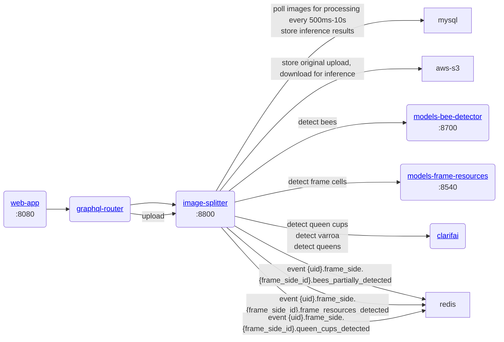
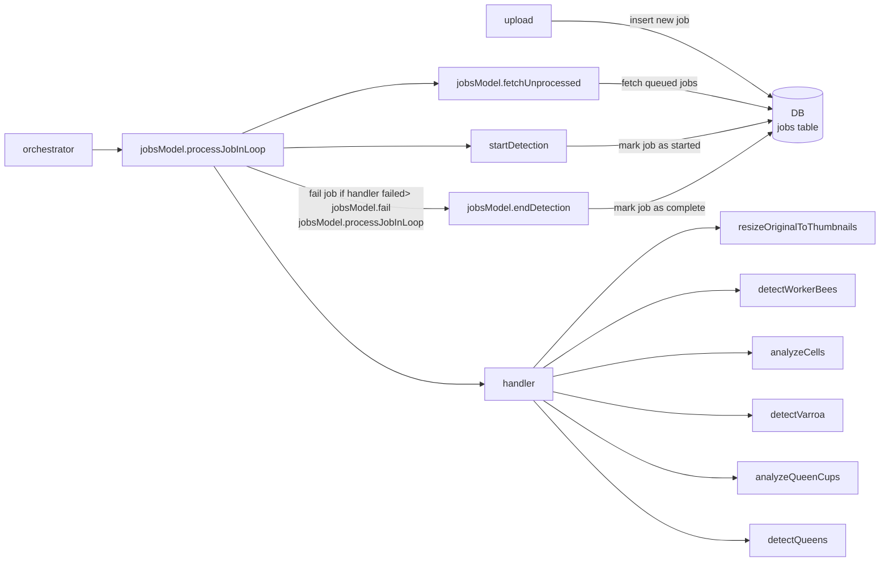

# gratheon / image-splitter
Processes uploaded beehive frame to detect various objects.
This is more of an orchestrator.
It splits frame into multiple sections for better detection results (thus the name).
In production its upload traffic is not going via graphql-router as federated graphql is not capable of forwarding binary uploads (yet?). Results are stored in mysql and forwarded to redis.

### URLs
- Dev: http://localhost:8800
- Prod: https://image.gratheon.com/graphql


## Architecture

### Service diagram


### Async worker processing / data flow
We use pure mysql DB for processing async jobs instead of redis pubsub and kafka (at least for now) because
- we want to have persistance and to query state of async jobs
- we want to have control over retries and error failure states



### Development
Copy `./src/config/config.default.ts` file as `./src/config/config.dev.ts` and change values if needed (for example AWS S3 credentials)

Then start a service in dockerized mode:
```
make start
```

#### DB migrations
We use `@databases/mysql` and run migrations automatically from `migrations` folder.
Its not perfect, its just pure SQL without ability to run programmatic migrations to have rollback support.
It also assumes we have single container that runs this at the service start.
To add migration, just add new file. Try to keep same naming convention.


### Roadmap / ToDo
- Change processing mechanism from polling to a queue (kafka?) to initiate processing faster
- Add more test coverage & improve types

### Testing
Minio is available at:
http://localhost:9001/buckets
minio-admin:minio-admin

Unit tests are executed with jest:
```bash
npm run test:unit
```

Integration tests spin up local docker containers and test against them:
```bash
make test-integration
```
