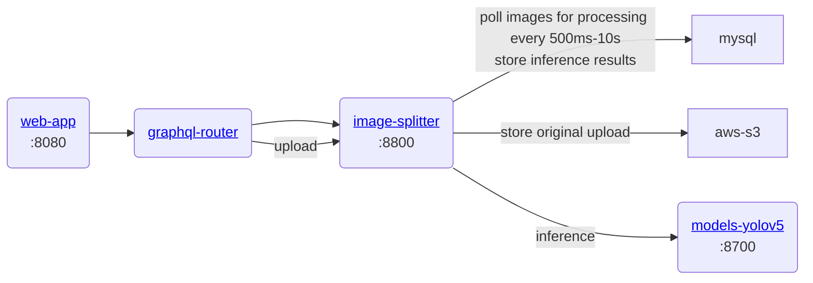

# gratheon / image-splitter
Main image processng microservice.
Uses darknet and custom trained yoloV3 model for inference

### URLs
localhost:8800

## Architecture



### Development
```
make start
```
