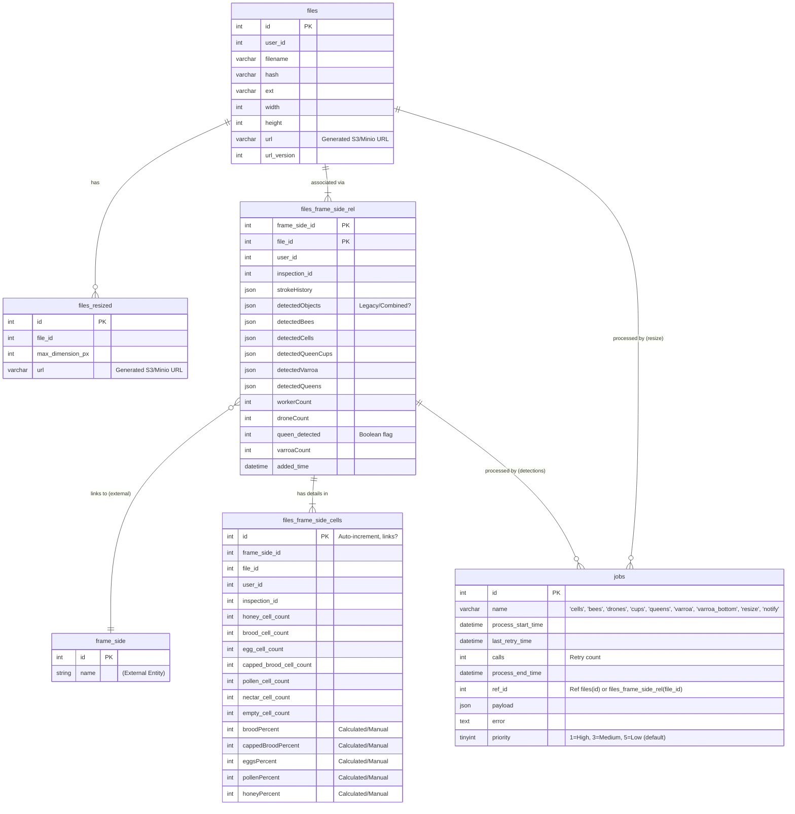

# Gratheon / image-splitter

[](https://snyk.io/test/github/Gratheon/image-splitter)


## Overview

The `image-splitter` microservice is a core component of the Gratheon platform responsible for processing images of beehive frames uploaded by users. Its primary function is to orchestrate the analysis of these images by invoking various internal and external machine learning models to detect key elements like bees (workers, drones, queens), brood cells, pollen, honey, queen cups, and varroa mites.

It receives uploaded images, stores them, manages a queue of analysis jobs, calls detection models, aggregates the results, and makes them available via the platform's federated GraphQL API. It also generates resized versions (thumbnails) of the original images.

**Key Responsibilities:**

*   Accepting direct image uploads (frame sides).
*   Storing original images and generated thumbnails in object storage (AWS S3/Minio).
*   Managing an asynchronous job queue (using MySQL + Redis Pub/Sub) for various detection tasks (resizing, bees, cells, queen cups, varroa, queens).
*   Orchestrating calls to internal ML models (`models-bee-detector`, `models-frame-resources`) and external services (Clarifai) for specific detections.
*   Storing detection results (bounding boxes, counts, percentages) in the database.
*   Publishing processing status updates via Redis Pub/Sub for real-time notifications.
*   Exposing processed data and initiating actions (like AI advice generation) through a federated GraphQL API.

## Key Features

*   Direct, authenticated image upload handling.
*   Asynchronous, persistent, and retry-capable job processing for image analysis tasks.
*   Integration with multiple ML models for comprehensive frame analysis.
*   Generation of image thumbnails.
*   Storage of raw detection data (e.g., bounding boxes) and summary statistics.
*   Federated GraphQL endpoint for querying results and managing frame data.
*   Integration with Sentry for error monitoring.
*   Configurable storage backend (AWS S3 for production, Minio for development/testing).

## Architecture

### High-Level Service Diagram


### Technology Stack

*   **Language:** TypeScript
*   **Framework:** Fastify
*   **API:** GraphQL (Apollo Server v3, Apollo Federation v1)
*   **Database:** MySQL (`@databases/mysql`)
*   **Job Queue:** Hybrid MySQL + Redis Pub/Sub (custom implementation)
*   **Cache/PubSub:** Redis (`ioredis`)
*   **Object Storage:** AWS S3 / Minio (`@aws-sdk/client-s3`)
*   **Image Processing:** Sharp, webp-converter
*   **ML Integrations:** Clarifai gRPC (`clarifai-nodejs-grpc`), Internal REST APIs
*   **Containerization:** Docker, Docker Compose
*   **Monitoring:** Sentry (`@sentry/node`)
*   **Testing:** Jest

## API Documentation

The service exposes a GraphQL endpoint, typically accessed via the federated `graphql-router`. However, for file uploads, clients interact directly with this service due to limitations in GraphQL federation handling `multipart/form-data`.

## URLs

*   Development: `http://localhost:8800/graphql`
*   Production: `https://image.gratheon.com/graphql` (Note: Uploads go directly here, not via the main router)

**Authentication:**

*   Requests via the router are authenticated using an internal signature (`internal-router-signature` header).
*   Direct requests (like uploads) must include a JWT in the `token` header.

### Key Mutations

*   `uploadFrameSide(file: Upload!): File`: Uploads a frame side image. Initiates the processing pipeline by creating relevant jobs (resize, detections).
*   `addFileToFrameSide(frameSideId: ID!, fileId: ID!, hiveId: ID!): Boolean`: Associates an uploaded file with a specific frame side and hive.
*   `filesStrokeEditMutation(files: [FilesUpdateInput]): Boolean`: Saves user-drawn annotations on an image.
*   `updateFrameSideCells(cells: FrameSideCellsInput!): Boolean!`: Allows manual correction of detected cell percentages.
*   `confirmFrameSideQueen(frameSideId: ID!, isConfirmed: Boolean!): Boolean!`: Manually confirms or denies the presence of a queen on a frame side.
*   `generateHiveAdvice(hiveID: ID, adviceContext: JSON, langCode: String): String`: Triggers a call to an external AI (e.g., GPT-4 via Clarifai) to generate advice based on hive data.
*   `cloneFramesForInspection(frameSideIDs: [ID], inspectionId: ID!): Boolean!`: Creates copies of frame side data associated with a new inspection record.

### Key Queries

*   `file(id:ID!): File`: Retrieves details about a specific file, including its resizes.
*   `hiveFiles(hiveId:ID!): [FrameSideFile]`: Gets all frame side files associated with a hive.
*   `hiveFrameSideFile(frameSideId:ID!): FrameSideFile`: Gets detailed information for a specific frame side file, including detection results.
*   `hiveFrameSideCells(frameSideId:ID!): FrameSideCells`: Gets the cell composition statistics for a frame side.
*   `frameSidesInspections(frameSideIds: [ID], inspectionId:ID!): [FrameSideInspection]`: Retrieves data for specific frame sides within the context of an inspection.

### Upload Sequence Diagram


*(Note: Subsequent detection jobs are typically added after `addFileToFrameSide` associates the file with a frame side)*

## Database Schema

The service uses a MySQL database to store file metadata, job queue information, and detection results.

**Key Tables:**

*   `files`: Stores metadata about uploaded original images (filename, dimensions, user_id, S3 URL).
*   `files_resized`: Stores information about generated thumbnails/resizes for each file.
*   `files_frame_side_rel`: Join table linking `files` to frame sides. Stores detection results (JSON blobs for bees, cells, cups, varroa, queens), counts, and user annotations (`strokeHistory`). Also includes `inspection_id`.
*   `files_frame_side_cells`: Stores detailed cell counts and calculated percentages (brood, honey, pollen, etc.) for a frame side. Includes `inspection_id`.
*   `files_frame_side_queen_cups`: (Potentially deprecated/merged into `files_frame_side_rel` based on migrations) Previously stored queen cup detection status. Includes `inspection_id`.
*   `jobs`: Manages the asynchronous processing queue. Tracks job type (`name`), status (start/end times), retries (`calls`), errors, payload, priority (1-5, lower is higher priority), and the reference ID (`ref_id`) linking to the relevant entity (e.g., `file_id`).
*   `files_hive_rel`: Join table linking files to hives for box-type images (e.g., varroa bottom board images).

### Entity-Relationship Diagram (ERD)



## Asynchronous Processing

The service utilizes a hybrid MySQL + Redis Pub/Sub job queue for handling time-consuming image analysis tasks asynchronously. This architecture eliminates database polling, reduces database load by 90-95%, and provides near-instant job processing.

### Architecture Overview

**Job Queue Design:**
- **MySQL Database**: Source of truth for job persistence, auditing, and recovery
- **Redis Pub/Sub**: Instant notification system to wake up workers when jobs are added
- **Workers**: Subscribe to Redis channels and process jobs on-demand

**Performance Benefits:**
- **~95% reduction** in database queries (no more polling every 10ms-10s)
- **<100ms latency** for job processing (vs 5 seconds with polling)
- **Instant notifications** via Redis pub/sub
- **Job prioritization** (high/medium/low) for optimal resource allocation
- **Rate limiting** per job type to prevent API quota exhaustion

### Job Types and Priorities

| Priority | Job Types | Rate Limit | Use Case |
|----------|-----------|------------|----------|
| 1 (High) | `resize`, `notify` | None | User-blocking operations |
| 3 (Medium) | `bees`, `drones`, `cells` | 100ms | Local AI processing |
| 5 (Low) | `varroa`, `varroa_bottom`, `queens`, `cups` | 2000ms | External API calls (Clarifai) |

**Rate Limiting**: External API jobs are limited to 30 calls/minute (2000ms between jobs) to prevent quota exhaustion.

### Workflow

1.  **Job Creation:** When an image is uploaded (`uploadFrameSide`) or associated with a frame (`addFileToFrameSide`), relevant jobs are inserted into the `jobs` table with:
    - `name`: Job type (e.g., 'resize', 'bees')
    - `ref_id`: Reference to `files.id`
    - `priority`: 1-5 (lower number = higher priority)
    - `payload`: Job-specific data
    - **Redis Notification**: A pub/sub message is published to `jobs:new:{name}` channel

2.  **Worker Subscription:** Background workers (initiated by `orchestrator.ts`) subscribe to Redis channels:
    - Each worker subscribes to `jobs:new:{jobType}` (e.g., `jobs:new:bees`)
    - Workers block on Redis, consuming no resources when idle

3.  **Job Notification:** When a job is added:
    - Database INSERT completes
    - Redis PUBLISH sent to `jobs:new:{name}`
    - All workers subscribed to that channel are notified instantly (<10ms)

4.  **Job Locking:** Upon notification, worker:
    - Queries database for highest priority pending job of that type
    - Locks job by setting `process_start_time` (prevents concurrent processing)
    - Jobs timeout after 1 minute if not completed (allows retry)

5.  **Execution:** The corresponding handler function executes:
    - `resizeOriginalToThumbnails` for resize jobs
    - `detectWorkerBees` for bee detection
    - `analyzeCells` for cell detection
    - `detectVarroa`, `detectQueens`, `analyzeQueenCups` for Clarifai jobs

6.  **External Calls:** Handlers download images from S3/Minio and call ML services:
    - Internal models: `models-bee-detector`, `models-frame-resources`
    - External API: Clarifai (varroa, queens, cups)

7.  **Result Storage:** Results stored in database tables:
    - `files_resized` for thumbnails
    - `files_frame_side_rel` for detection results (JSON blobs)
    - `files_frame_side_cells` for cell statistics

8.  **Job Completion/Failure:** 
    - **Success**: Set `process_end_time`, check for more pending jobs
    - **Failure**: Log error, increment `calls`, set `process_end_time`

9.  **Retries:** Failed jobs automatically retry up to 2 times (total 3 attempts)

10. **Notification:** Many jobs create a `notify` job upon completion:
    - Handled by `notifyViaRedis` worker
    - Publishes real-time updates to user-specific Redis channels
    - Enables live UI updates in web-app

### Startup Recovery

On service startup, the system:
1. Queries database for incomplete jobs (`process_end_time IS NULL`)
2. Publishes Redis notifications for each pending job
3. Workers pick up and process orphaned jobs
4. **Zero job loss** even if Redis or service restarts

### Worker Architecture & Concurrency

**Worker Model:**
- **Single worker per job type**: Each job type (resize, bees, drones, cells, etc.) has ONE dedicated worker loop
- **Sequential processing**: Workers process jobs one at a time within their type
- **No parallel limit**: Jobs queue up but process sequentially, preventing overwhelming system resources

**Example: Uploading 20 Images**

When 20 images are uploaded simultaneously:
1. **140 jobs created** (20 images × 7 job types: resize, bees, drones, cells, cups, queens, varroa)
2. Each worker processes its queue sequentially
3. **No concurrent job limit** - all jobs are queued, not rejected
4. Processing order: Priority (1-5) → Job ID (FIFO within priority)

**Worker Concurrency Model:**
```
Upload 20 images
  ↓
[Priority 1: resize] ──> [Job 1] → [Job 2] → [Job 3] → ... → [Job 20]
[Priority 3: bees]   ──> [Job 1] → [Job 2] → [Job 3] → ... → [Job 20]
[Priority 3: drones] ──> [Job 1] → [Job 2] → [Job 3] → ... → [Job 20]
[Priority 3: cells]  ──> [Job 1] → [Job 2] → [Job 3] → ... → [Job 20]
[Priority 5: varroa] ──> [Job 1] → [Job 2] → [Job 3] → ... → [Job 20]
[Priority 5: queens] ──> [Job 1] → [Job 2] → [Job 3] → ... → [Job 20]
[Priority 5: cups]   ──> [Job 1] → [Job 2] → [Job 3] → ... → [Job 20]
```

**Concurrency Limits:**
- ✅ **Between workers**: 7 workers run concurrently (one per job type)
- ❌ **Within worker**: Sequential processing only (1 job at a time per worker)
- ❌ **Image chunks**: Processed sequentially within each job (6-16 chunks per image)
- ⚠️ **No queue depth limit**: Jobs queue indefinitely, not rejected (could grow unbounded)

**Database Connection Usage:**
- **Connection pool size**: 20 connections (configurable in `src/models/storage.ts:37`)
- **Active connections**: ~7-10 (one per active worker + queries)
- **Logger connections**: 3 separate connections (separate pool for log persistence)
- **Queue timeout**: 10 seconds (prevents indefinite waiting)
- **Connection recycling**: After 5000 uses (prevents memory leaks)
- **Idle timeout**: 60 seconds (closes unused connections)

### Bee/Drone Detection Flow

Worker bee and drone detection split images into chunks for processing:

**Chunking Strategy:**
- Images are split into a grid based on dimension threshold (typically 800-1024px per chunk)
- **Calculation**: `maxCuts = floor(imageDimension / chunkSize)`
- Example: 4000×3000px image with 1024px chunks → 3×2 grid = **6 chunks**
- Chunks are processed **sequentially** (not in parallel)

**Processing Pipeline:**

1. **Chunk Processing** (each chunk processed sequentially):
   - Cut image into chunk using Sharp library
   - Send chunk to ML service (`models-bee-detector` or `models-drone-bees`)
   - Receive detections (bounding boxes, confidence scores)
   - Transform coordinates from chunk-space to full-image-space
   - **Atomically append** detections to database using `JSON_MERGE_PRESERVE`
   - Increment worker/drone count counters
   
2. **Partial Updates** (optional, after each chunk):
   - Published to `{uid}.frame_side.{frameSideId}.bees_partially_detected`
   - Includes `isBeeDetectionComplete: false`
   - Allows progressive UI updates (not currently implemented)
   
3. **Final Completion** (after ALL chunks processed):
   - Query final counts from database
   - Create `NOTIFY_JOB` with priority=1
   - Published to `{uid}.frame_side.{frameSideId}.bees_detected`
   - Includes `isBeeDetectionComplete: true` and final counts
   
**Atomic Updates:**
- Uses MySQL's `JSON_MERGE_PRESERVE` to avoid race conditions
- Each chunk's detections are appended atomically
- Counters incremented with `IFNULL(count, 0) + newCount`
- No read-modify-write cycles that could lose data

**Memory & Performance:**
- Full image loaded once at start (using `fs.promises.readFile`)
- Chunks cut from in-memory buffer (no disk I/O per chunk)
- Sequential processing prevents memory explosion
- Each chunk ~1MB, full image ~5-15MB in memory during processing

### Worker Sequence Diagram (Redis-based Queue)


## Redis Events / Notifications

Upon successful completion of certain asynchronous detection jobs, the service publishes events to a Redis Pub/Sub channel. This allows downstream services (e.g., `event-stream-filter`, `web-app`) to react to processing updates in real-time.

**Mechanism:**

1.  A detection worker (e.g., `detectWorkerBees`) finishes processing for a `file_id`.
2.  It marks its specific job as complete in the `jobs` table.
3.  Crucially, it enqueues a new job of type `notify` into the `jobs` table, often including the original `file_id` (as `ref_id`) and potentially context about the completed step in the payload.
4.  The `notifyViaRedis` worker picks up this `notify` job.
5.  This worker likely queries the database using the `ref_id` (file\_id) to retrieve associated identifiers like `user_id` (`uid`) and `frame_side_id`.
6.  It constructs an event topic string using these identifiers.
7.  It publishes a message (often just a simple notification, the details are usually fetched via GraphQL later) to the specific Redis channel.

**Event Pattern:**

The general pattern for the Redis channel is: `{uid}.frame_side.{frame_side_id}.<detection_type>_detected`

**Key Events Published:**

*   `{uid}.frame_side.{frame_side_id}.bees_detected`
*   `{uid}.frame_side.{frame_side_id}.cells_detected` (or `frame_resources_detected`)
*   `{uid}.frame_side.{frame_side_id}.queen_cups_detected`
*   `{uid}.frame_side.{frame_side_id}.queens_detected`
*   `{uid}.frame_side.{frame_side_id}.varroa_detected`

*(Note: The exact event names might vary slightly based on implementation details in `notifyViaRedis.ts`)*

### Notification Sequence Diagram


## Configuration

Configuration is managed via files in `src/config/` (`config.default.ts`, `config.dev.ts`, `config.testing.ts`) and environment variables. Key configuration options (refer to `config.default.ts` for defaults):

*   `routerSignature`: Secret shared with `graphql-router`.
*   `sentryDsn`: DSN for Sentry error reporting.
*   `schema_registry_url`: URL for the GraphQL Schema Registry.
*   `selfUrl`: Publicly accessible URL of this service for the registry.
*   `yolo_v5_url`: Endpoint for the internal bee detection model.
*   `models_frame_resources_url`: Endpoint for the internal cell detection model.
*   `mysql`: Database connection details (host, port, user, password, database).
*   `aws`: S3/Minio configuration (bucket, key, secret, endpoint, public URL).
*   `jwt.privateKey`: Secret key for JWT verification (must match `user-cycle` service).
*   `clarifai`: API Keys (PATs) for different Clarifai applications (varroa, queen, cups, beekeeper AI).

Environment variables like `NATIVE` (for local vs. Docker) and `ENV_ID` (dev, testing, prod) influence which configuration values are used.

## Development

### Prerequisites

*   **Node.js** v18+ (check with `node --version`)
*   **Docker** and **Docker Compose** (for running services)
*   **Just** command runner (optional but recommended: `brew install just`)
*   **MySQL Client** (for manual database operations)
*   **Redis CLI** (for debugging pub/sub)

### Setup

1.  **Clone Repository**:
    ```bash
    git clone https://github.com/Gratheon/image-splitter.git
    cd image-splitter
    ```

2.  **Configuration**: 
    ```bash
    cp src/config/config.default.ts src/config/config.dev.ts
    ```
    
    Update `config.dev.ts` with:
    - AWS/Minio credentials (use Minio for local dev)
    - Clarifai PATs (optional, for testing external APIs)
    - MySQL connection (defaults work with Docker Compose)
    - Redis connection (defaults work with Docker Compose)

3.  **Install Dependencies**:
    ```bash
    npm install
    ```

4.  **Start Services**: 
    ```bash
    just start
    # Or manually:
    docker-compose -f docker-compose.dev.yml up --build
    ```
    
    This starts:
    - `image-splitter` service (port 8800)
    - MySQL database (port 5100)
    - Minio object storage (port 19000, console: 19001)
    - Redis (port 6379)

5.  **Verify Services**:
    ```bash
    # Check health
    curl http://localhost:8800/healthz
    
    # Check job stats
    curl http://localhost:8800/jobs/stats
    
    # Access GraphQL playground
    open http://localhost:8800/graphql
    
    # Access Minio console
    open http://localhost:19001
    # Login: minio-admin / minio-admin
    ```

### Development Workflow

**Hot Reload**: The dev environment uses `tsc-watch` for automatic recompilation:
```bash
# Logs show compilation and restart
docker-compose -f docker-compose.dev.yml logs -f image-splitter
```

**View Logs**:
```bash
# All services
docker-compose -f docker-compose.dev.yml logs -f

# Specific service
docker-compose -f docker-compose.dev.yml logs -f image-splitter

# Follow job processing
docker-compose -f docker-compose.dev.yml logs -f | grep "Processing job"
```

**Database Access**:
```bash
# Connect to MySQL
docker exec -it image-splitter-mysql-1 mysql -u root -ptest image-splitter

# Or via local client
mysql -h 127.0.0.1 -P 5100 -u root -ptest image-splitter
```

**Redis Monitoring**:
```bash
# Connect to Redis CLI
docker exec -it image-splitter-redis-1 redis-cli

# Monitor pub/sub messages
> MONITOR

# Subscribe to job notifications
> PSUBSCRIBE jobs:new:*

# Subscribe to user events
> PSUBSCRIBE *.frame_side.*
```

**Useful Just Commands**:
```bash
just --list          # Show all available commands
just start           # Start dev environment
just stop            # Stop services
just restart         # Restart services
just test-integration # Run integration tests
just logs            # Tail service logs
```

### Database Migrations

Migrations are plain SQL files located in the `migrations/` directory. They are applied automatically on service startup using `@databases/mysql`.

*   **Adding Migrations:** Create a new SQL file in `migrations/` following the naming convention (e.g., `020-new-feature.sql`). The service will apply it on the next restart.
*   **Schema Generation:** You can generate TypeScript types from the DB schema using `npm run generate-db-schema` (ensure DB is running).

## Testing

The service includes comprehensive unit and integration tests using Jest.

### Unit Tests

Tests individual functions and modules in isolation.

**Run unit tests:**
```bash
npm run test:unit
```

**Coverage:**
- Job model logic (`jobs.ts`)
- Data transformation functions
- Frame side models
- Detection result processing

**Configuration:** `test/unit/jest.coverage.json`

### Integration Tests

Tests the entire service stack including database, Redis, and S3 interactions.

**Run integration tests:**
```bash
just test-integration
```

**What it does:**
1. Spins up test environment via `docker-compose.test.yml`:
   - MySQL database (port 5100)
   - Redis (port 6379)
   - Minio object storage (port 19000)
2. Runs database migrations
3. Executes test suite against running services
4. Tears down test environment

**Test coverage:**
- GraphQL mutations and queries
- File upload flow
- Job queue processing
- Redis pub/sub notifications
- S3/Minio integration

**Configuration:** `test/integration/jest.coverage.json`

### Manual Testing

**Upload a test image:**
```bash
curl -X POST http://localhost:8800/graphql \
  -H "token: YOUR_JWT_TOKEN" \
  -F operations='{"query": "mutation($file: Upload!) { uploadFrameSide(file: $file) { id url } }", "variables": {"file": null}}' \
  -F map='{"0": ["variables.file"]}' \
  -F 0=@test-frame.jpg
```

**Check job queue status:**
```bash
curl http://localhost:8800/jobs/stats | jq
```

**Monitor Redis events:**
```bash
docker exec -it image-splitter-redis-1 redis-cli
> SUBSCRIBE jobs:new:*
> PSUBSCRIBE *.frame_side.*.bees_detected
```

### Test Data

Sample test images should be added to `test/fixtures/` directory with various scenarios:
- Different image sizes (small, medium, large)
- Various bee densities (empty, sparse, dense)
- Different frame types (brood, honey, mixed)
- Edge cases (damaged frames, poor lighting)

## Troubleshooting

### Jobs Not Processing

**Symptoms**: Jobs stuck in pending state, no processing activity

**Check:**
```bash
# 1. Verify workers are subscribed to Redis
docker logs image-splitter | grep "subscribed to jobs:new"
# Should see: "Worker for bees subscribed to jobs:new:bees" for each job type

# 2. Check Redis connectivity
docker exec -it image-splitter-redis-1 redis-cli PING
# Should return: PONG

# 3. Check job queue
curl http://localhost:8800/jobs/stats | jq '.jobs.bees'
# Look for high pending count

# 4. Check for errors in logs
docker logs image-splitter | grep -i error

# 5. Manually trigger a Redis notification
docker exec -it image-splitter-redis-1 redis-cli
> PUBLISH jobs:new:bees '{"refId":123,"priority":3}'
```

**Solutions**:
- Restart the service to re-subscribe workers
- Check Redis is running: `docker ps | grep redis`
- Verify database connectivity
- Check for stuck jobs (process_start_time < NOW() - 1 MINUTE)

### Bee/Drone Detection Not Finalizing

**Symptoms**: Partial results appear but `isBeeDetectionComplete` never set to true

**Check:**
```bash
# Check if all 9 chunks completed
docker logs image-splitter | grep "Processing part"
# Should see: "Processing part 1/9" through "Processing part 9/9"

# Check for NOTIFY_JOB creation
curl http://localhost:8800/jobs/stats | jq '.jobs.notify'

# Monitor final completion messages
docker logs image-splitter | grep "all chunks processed"
```

**Solutions**:
- Check ML service availability (`models-bee-detector`, `models-drone-bees`)
- Verify enough memory for image processing (4GB+ recommended)
- Check for chunk processing errors in logs

### Redis Pub/Sub Not Working

**Symptoms**: No real-time updates in web-app

**Check:**
```bash
# Monitor Redis subscriptions
docker exec -it image-splitter-redis-1 redis-cli
> CLIENT LIST
# Look for subscribers

> PUBSUB CHANNELS
# Should see: jobs:new:bees, jobs:new:cells, etc.

# Test pub/sub manually
> SUBSCRIBE jobs:new:bees
> # In another terminal:
> PUBLISH jobs:new:bees "test"
```

**Solutions**:
- Restart Redis: `docker restart image-splitter-redis-1`
- Check Redis memory usage
- Verify network connectivity between services

### Database Performance Issues

**Symptoms**: Slow job processing, timeouts

**Check:**
```bash
# Check active queries
docker exec -it image-splitter-mysql-1 mysql -u root -ptest -e "SHOW PROCESSLIST;"

# Check slow queries
docker exec -it image-splitter-mysql-1 mysql -u root -ptest -e "SELECT * FROM mysql.slow_log LIMIT 10;"

# Check table sizes
docker exec -it image-splitter-mysql-1 mysql -u root -ptest image-splitter -e "
SELECT 
  table_name, 
  ROUND(data_length/1024/1024, 2) AS 'Data Size (MB)',
  table_rows 
FROM information_schema.tables 
WHERE table_schema='image-splitter';"
```

**Solutions**:
- Add missing indexes (check migration 023-job-priorities.sql)
- Archive old completed jobs
- Optimize `files_frame_side_rel` table (large JSON columns)

### Out of Memory (OOM)

**Symptoms**: Container restarts, image processing fails

**Check:**
```bash
# Check memory usage
docker stats image-splitter

# Check memory limit
docker inspect image-splitter | grep -i memory
```

**Solutions**:
- Increase container memory limit (4-8GB recommended)
- Reduce concurrent job processing
- Clear tmp directory: `docker exec image-splitter rm -rf /app/tmp/*`

### ML Service Connectivity

**Symptoms**: Detection jobs fail with connection errors

**Check:**
```bash
# Test bee detector
curl -X POST http://models-bee-detector:8000/detect -F "file=@test.jpg"

# Test frame resources
curl -X POST http://models-frame-resources:8000/detect -F "file=@test.jpg"

# Check DNS resolution
docker exec image-splitter nslookup models-bee-detector
```

**Solutions**:
- Verify ML services are running
- Check Docker network configuration
- Update service URLs in config.dev.ts

### Common Error Messages

| Error | Cause | Solution |
|-------|-------|----------|
| `Redis connection timeout` | Redis not running or unreachable | Start Redis container |
| `Failed to acquire lock on job` | Concurrent processing attempt | Normal, worker will retry |
| `File not found in S3` | Missing or deleted file | Check S3/Minio bucket |
| `clarifai.StatusCodeException` | API quota exceeded or invalid PAT | Check Clarifai dashboard |
| `Cannot read property 'width' of null` | File metadata missing | Re-upload file |
| `Out of memory` | Image too large or memory limit too low | Increase memory limit |

## Deployment

*   The service is designed to run in Docker containers.
*   `Dockerfile.prod` defines the production image build process.
*   `docker-compose.yml` provides an example of production deployment configuration (though actual deployment might use Kubernetes or other orchestrators).

### Production Requirements

**Infrastructure:**
- **MySQL Database**: For job persistence and data storage
- **Redis**: For job notifications and real-time pub/sub events
- **S3-compatible Object Storage**: AWS S3 (production) or Minio (dev/test)
- **Internal ML Services**: 
  - `models-bee-detector` (bee/drone detection)
  - `models-frame-resources` (cell detection)
- **External APIs**: Clarifai API keys (varroa, queens, cups, AI advice)

**Environment Configuration:**
- `ENV_ID=prod` to use production configuration
- Valid Sentry DSN for error monitoring
- Clarifai Personal Access Tokens (PATs)
- AWS S3 credentials (or Minio endpoint for self-hosted)
- MySQL connection details
- Redis connection details
- JWT private key (shared with `user-cycle` service)
- Router signature (shared with `graphql-router`)

### Deployment Steps

1. **Database Migration**: Run all SQL migrations from `migrations/` directory
   ```bash
   # Migrations are auto-applied on service startup
   # Or manually apply:
   for file in migrations/*.sql; do
     mysql -h $DB_HOST -u $DB_USER -p$DB_PASS $DB_NAME < $file
   done
   ```

2. **Build Docker Image**:
   ```bash
   docker build -f Dockerfile.prod -t image-splitter:latest .
   ```

3. **Deploy Container**:
   - Listens on port 8800 internally
   - Requires network access to MySQL, Redis, S3, and ML services
   - Set memory limit to at least 4GB (`--memory=4g`)
   - Set CPU limit based on expected load

4. **Verify Deployment**:
   ```bash
   # Health check
   curl http://your-service:8800/healthz
   
   # Job queue stats
   curl http://your-service:8800/jobs/stats
   
   # Check logs for worker subscriptions
   docker logs image-splitter | grep "subscribed to jobs:new"
   ```

### Scaling Considerations

**Horizontal Scaling**: Currently, the service is designed to run as a single instance due to:
- Job locking mechanism (prevents duplicate processing)
- In-memory worker subscriptions

**Future Improvements for Multi-Instance**:
- Use Redis-based distributed locking
- Implement proper job claim mechanism
- Add worker instance coordination

**Vertical Scaling**: 
- Increase memory for handling larger images (4-8GB recommended)
- More CPU cores improve parallel chunk processing (bee/drone detection)

### Production Differences from Development

- **Storage**: AWS S3 instead of Minio
- **Redis**: Production Redis instance with persistence
- **Database**: Production MySQL with replication/backups
- **Monitoring**: Sentry integration enabled
- **ML Services**: Production endpoints with higher quotas
- **SSL/TLS**: Handled by ingress/load balancer
- **Authentication**: Stricter JWT validation

### Monitoring in Production

**Key Metrics to Track**:
- Job queue depth (`/jobs/stats` endpoint)
- Job processing time (avg per job type)
- Job failure rate (failures / total)
- Database connection pool usage
- Redis pub/sub message rate
- S3 request count and latency
- Memory usage (track for OOM issues)
- External API quota usage (Clarifai)

**Alerts to Configure**:
- Job queue backed up (>100 pending jobs)
- High failure rate (>5% for any job type)
- Database connection failures
- Redis disconnections
- S3 upload failures
- ML service timeouts
- Memory approaching limit

## Monitoring & Logging

*   **Error Reporting:** Integrated with Sentry (`sentryDsn` must be configured).
*   **Logging:** Uses custom logger (`@gratheon/log-lib`) with dual output:
    - Console output for container logs (stdout/stderr)
    - MySQL persistence for log history and debugging

### Database Connection Pool Stability

**Recent Improvements** (as of 2026-01):

To prevent connection pool exhaustion under high load, several optimizations have been implemented:

**Connection Pool Configuration** (`src/models/storage.ts:33-40`):
```typescript
{
  poolSize: 20,                        // Max 20 connections (was: unlimited)
  queueTimeoutMilliseconds: 10000,     // Wait max 10s for connection (was: 60s)
  idleTimeoutMilliseconds: 60000,      // Close idle connections after 60s
  maxUses: 5000,                       // Recycle connections after 5000 uses
}
```

**Impact:**
- ✅ Prevents connection exhaustion when processing many images simultaneously
- ✅ Faster failure detection (10s timeout vs 60s)
- ✅ Automatic connection recycling prevents memory leaks
- ✅ Idle connection cleanup reduces resource usage

**Separate Logger Connection Pool:**
- Logger has its own connection pool (3 connections max)
- Prevents logger from consuming application connections
- Graceful fallback: if logger DB fails, logs still go to console

**Common Connection Pool Errors:**

| Error | Meaning | Solution |
|-------|---------|----------|
| `Timed out waiting for connection from pool` | All 20 connections in use, queue exhausted | Normal under heavy load; jobs will retry |
| `Failed to persist log to DB` | Logger connection pool exhausted (dev only) | Increase logger pool size or disable DB logging |
| `CONNECTION_POOL:QUEUE_TIMEOUT` | Waited 10s for connection, none available | Check for slow queries, increase pool size |

**Monitoring Connection Health:**
```bash
# Watch connection count in real-time
docker logs image-splitter -f | grep "Active connections"

# Check for connection timeouts
docker logs image-splitter | grep "Timed out waiting"

# Monitor slow queries
docker exec image-splitter-mysql-1 mysql -u root -ptest -e "SHOW PROCESSLIST;"
```

**Tuning Guidelines:**
- **High load** (>50 concurrent uploads): Increase `poolSize` to 30-50
- **Slow ML services**: Increase `queueTimeoutMilliseconds` to 20000-30000
- **Memory constrained**: Reduce `idleTimeoutMilliseconds` to 30000
- **Connection leaks suspected**: Reduce `maxUses` to 1000-2000

### Health & Monitoring Endpoints

The service exposes several HTTP endpoints for monitoring:

*   **`GET /healthz`** - Health check endpoint
    ```json
    {
      "status": "ok",
      "mysql": "connected"  // or "disconnected"
    }
    ```

*   **`GET /jobs/stats`** - Job queue statistics (NEW)
    ```json
    {
      "status": "ok",
      "jobs": {
        "resize": {
          "total": 1523,
          "pending": 5,
          "completed": 1510,
          "failed": 8,
          "avgProcessingTime": 2.34  // seconds
        },
        "bees": { ... },
        "drones": { ... },
        "cells": { ... },
        "cups": { ... },
        "queens": { ... },
        "varroa": { ... },
        "varroa_bottom": { ... },
        "notify": { ... }
      }
    }
    ```
    
    **Use cases:**
    - Monitor job queue depth (pending jobs)
    - Track failure rates by job type
    - Identify performance bottlenecks (avg processing time)
    - Alert on stuck jobs or high error rates

*   **`GET /`** - API documentation page listing all endpoints

*   **`GET /graphql`** - GraphQL playground (development/testing)

## License

This project is **dual-licensed**:

- **[AGPL v3](LICENSE-AGPL.md)** - For open source use:
    - ✅ You can use, modify, and distribute the software
    - ✅ Source code is freely available
    - ⚠️ If you modify and host a public instance, you must share your modifications
    - ⚠️ Any derivative work must also be licensed under AGPL v3

- **[Commercial License](LICENSE-COMMERCIAL.md)** - For enterprise customers who need:
    - 🏢 On-premise deployment without source disclosure
    - 🔧 Custom modifications without copyleft obligations
    - 📞 Priority support and SLA guarantees


### Contributing

If you'd like to contribute, please see our [Contributing Guide](CONTRIBUTING.md) and sign our Contributor License Agreement (CLA).

*   Please refer to the `CODEOWNERS` file for ownership details.
*   Follow standard GitHub flow: Fork the repository, create a feature branch, make changes, and submit a Pull Request.